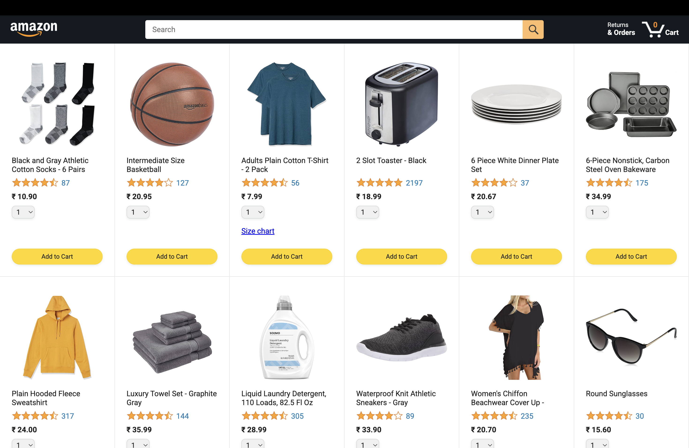
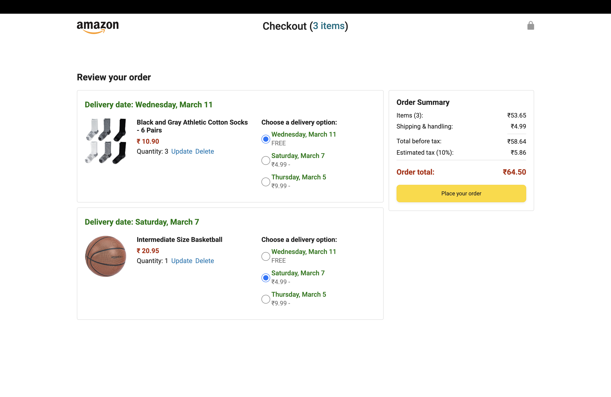
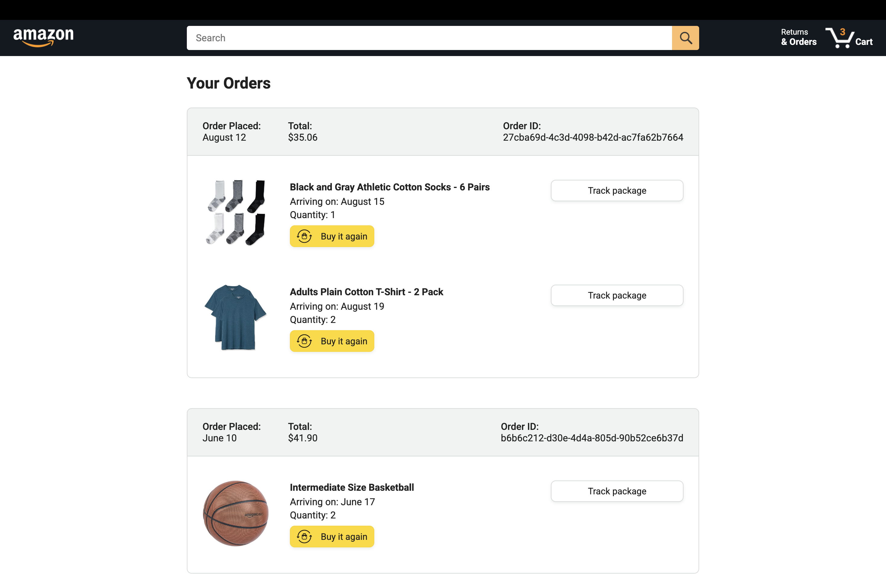

# Amazon Clone


A simplified **Amazon-style e-commerce interface** built using **HTML, CSS, and Vanilla JavaScript**.  
The project replicates core shopping functionality such as browsing products, adding items to the cart, reviewing orders, and navigating across multiple pages. Cart and order data are persisted using **Browser LocalStorage**, allowing the application state to remain available even after refreshing the browser.

---

## Live Demo

[View Live Demo](https://mabhishek-dev.github.io/amazon-project/)

---

## Tech Stack

- **HTML5**
- **CSS3**
- **JavaScript (Vanilla JS)**
- **Browser LocalStorage**

---

## Features

- Product listing interface similar to Amazon  
- Add products to cart  
- Dynamic cart updates  
- Checkout page with **order summary** and **payment summary**  
- Orders page displaying previously placed orders  
- Multi-page navigation (**Home, Checkout, Orders, Tracking**)  
- Persistent cart and order data using **Browser LocalStorage**

---

## Purpose

This project focuses on building a **multi-page e-commerce interface** while strengthening JavaScript fundamentals and application structure.

Key concepts practiced include:

- Dynamic rendering of product data  
- Managing cart state and order summaries  
- Structuring JavaScript using a **modular architecture**  
- Updating the UI based on user interactions  
- Persisting application data using **Browser LocalStorage**

---

## Project Structure

```
amazon-project/
│
├── index.html
├── checkout.html
├── orders.html
├── tracking.html
│
├── scripts/
│   └── ...
│
├── styles/
│   └── ...
│
├── images/
│   └── ...
│
├── data/
│   └── ...
│
└── screenshots/
    ├── main-page.png
    ├── checkout-page.png
    └── orders-page.png
```

---

## Setup Instructions

Clone the repository:

```bash
git clone https://github.com/mabhishek-dev/amazon-project.git
cd amazon-project
```

Then open:

```
index.html
```

in your browser.

No build tools or external dependencies are required.

---

## Screenshots

### Main Page


### Checkout Page


### Orders Page


---

## Disclaimer

This project is created for educational purposes only.  
It is not affiliated with, endorsed by, or associated with Amazon.

---

## License

This project is licensed under the **MIT License**.
